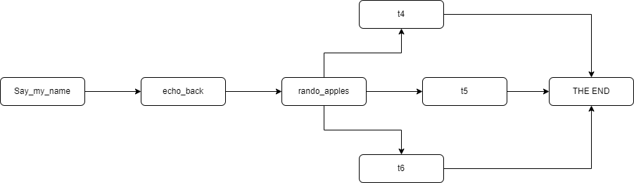

# _Apache Code Reviq_

#### By _**Bri Chavez**_

#### _A brief code using apache airflow, bash commands, and docker_

## Technologies Used

* _Python_
* _Airflow_
* _Docker_

## Description

_This code showcases what I have learned in my first week of Airflow. It takes echo bash commands to repeat our name back at us and a for loop to assign task names and a function that will return random apples from a list_

## Setup/Installation Requirements

* _https://github.com/BriChavez/dag_yo_
* _Clone the repositorty to whereever you want the program to live_
* _Start a virtualenv and pip install -r requiremnts_
* _Run the review.py file_
* _Follow diresctions in the airflow_setup.sh file_

## Known Bugs

* _Not sure if it runs through Docker_

## License

_This code is the property of one Bri Chavez. You are welcome to use it, i dont mind. Any questions, concerns, comments, feel free to reachout at brianachavez@gmail.com_

Copyright (c) _June 2022_ _BriChavez_